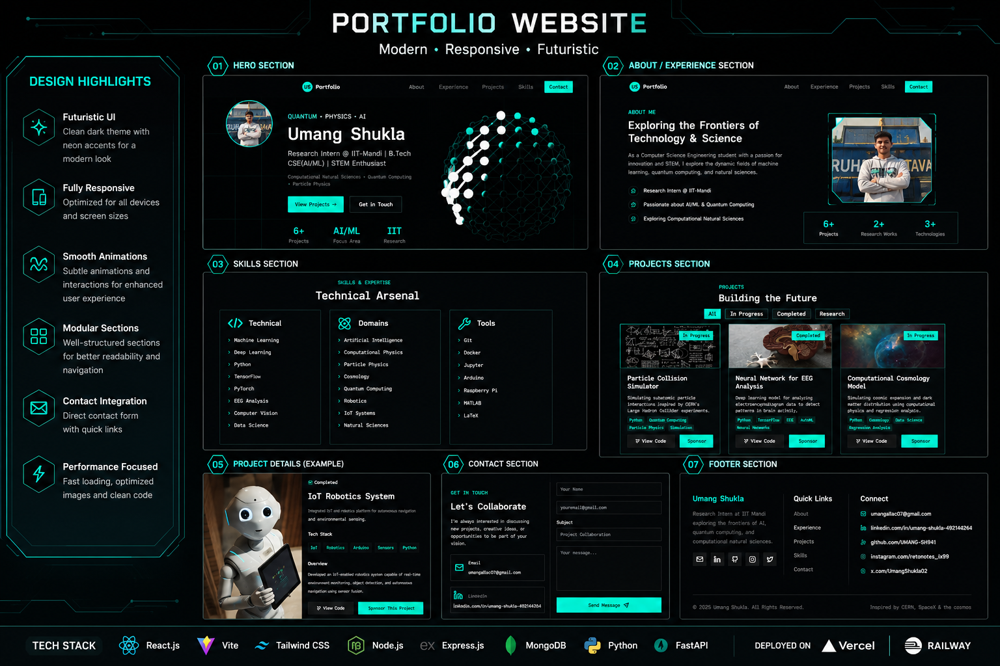

# 🚀 Portfolio

  

# 📸 Portfolio Preview

## Head Section

## Projects Section

## Skills Section

## Contact Section

---

# 🔗 Live Website

🌍 https://portfolio-two-neon-52.vercel.app

---
---

# 🌌 ATOM INSPIRED PORTFOLIO

A modern cyberpunk-inspired portfolio built with:

- React.js
- FastAPI
- MongoDB Atlas
- Vercel
- Railway

Focused on:
- Artificial Intelligence
- Quantum Computing
- Computational Physics
- Particle Physics
- Robotics
- Cosmology

---

# ⚡ Features

✅ Animated futuristic UI  
✅ Dynamic project management  
✅ MongoDB database integration  
✅ Admin dashboard  
✅ Responsive design  
✅ Portfolio analytics  
✅ Project filtering  
✅ Contact system  
✅ Cyberpunk aesthetic

---

# 🧠 Tech Stack

## Frontend
- React.js
- Tailwind CSS
- Framer Motion

## Backend
- FastAPI
- Python
- MongoDB

## Deployment
- Vercel
- Railway

---

# 👨‍💻 Author

## Umang Shukla

Research Intern @ IIT Mandi  
B.Tech CSE (AI/ML)

- GitHub: https://github.com/UMANG-SH941
- LinkedIn: https://linkedin.com/in/umang-shukla-492144264
- X: [https://x.com/zXumangsh_](https://x.com/zXumangsh)

---

# ⭐ Future Goals

- AI Research Projects
- Quantum Computing Simulations
- Robotics + IoT Systems
- Open Source Contributions
- Computational Natural Sciences
